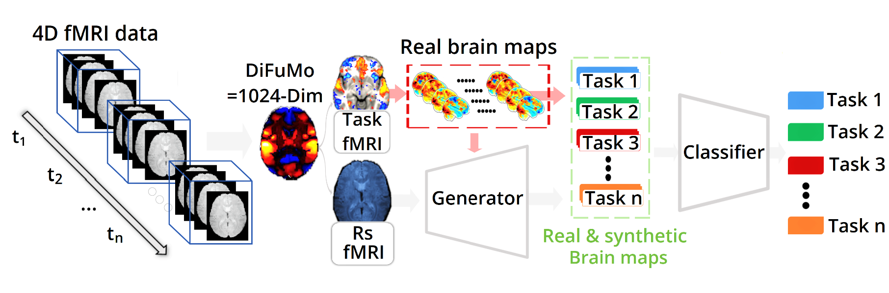
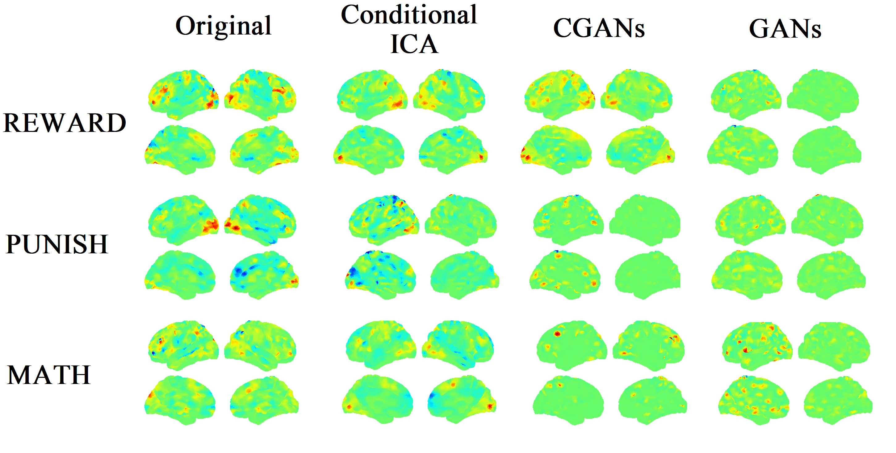

# AugfMRI: Functional Magnetic Resonance Imaging data augmentation through conditional ICA (MICCAI2021-Oral)

> **Authors:**
> [Badr Tajini](https://scholar.google.fr/citations?user=YuxT3tYAAAAJ&hl=en) &ast;,  [Hugo Richard](https://scholar.google.fr/citations?user=5KaKAOgAAAAJ&hl=en) &ast;, and [Bertrand Thirion](https://scholar.google.fr/citations?user=MeKi5_AAAAAJ&hl=en). <br>
> &ast; Equal contribution <br>
arXiv:  [[PDF](https://arxiv.org/abs/2107.06104v2)] <br>
HAL: [[PDF](https://hal.archives-ouvertes.fr/hal-03284313v1)] <br>

## Abstract 

Advances in computational cognitive neuroimaging research are related to the availability of large amounts of labeled brain imaging data, but such data are scarce and expensive to generate. While powerful data generation mechanisms, such as Generative Adversarial Networks (GANs), have been designed in the last decade for computer vision, such improvements have not yet carried over to brain imaging. A likely reason is that GANs training is ill-suited to the noisy, highdimensional and small-sample data available in functional neuroimaging.
In this paper, we introduce Conditional Independent Components Analysis (Conditional ICA): a fast functional Magnetic Resonance Imaging (fMRI) data augmentation technique, that leverages abundant restingstate data to create images by sampling from an ICA decomposition. We then propose a mechanism to condition the generator on classes observed with few samples. We first show that the generative mechanism is successful at synthesizing data indistinguishable from observations, and that it yields gains in classification accuracy in brain decoding problems. In particular it outperforms GANs while being much easier to optimize and interpret. Lastly, Conditional ICA enhances classification accuracy in eight datasets without further parameter tuning.

## Framework Overview
<p align="center">
     <br />
    <em>
    Figure 1: Overview of the proposed Conditional ICA approach, which generates surrogate data from Task and Rest fMRI data by synthesizing statistical maps that qualitatively fit the distribution of the original maps.
    </em>
</p>

## Qualitative Results
<p align="center">
     <br />
    <em>
    Figure 2: Data generation visualization. Visualization of real (Original) and synthetic brain maps from three generation methods: Conditional ICA (Ours), CGANs and GANS. Three cognitive tasks are shown (reward, punish and math).
    </em>
</p>

## Usage
**[Important]**
>This release is only a demo to understand how our method works. A toolbox gathering all the features to reproduce the results of the paper from Raw data to the interpretation of the results (visualization) is under development and will be released in the next few days.

### Install

- Clone this repository

- Move into the cloned directory and execute

`pip install -e .`

- To run the example, go into the `examples` folder and run
`python decoding.py`

- To run the tests just run
`pytest`


## Citation
If you find this repository useful in your research, please cite:
```
@inproceedings{tajini2021functional,
  address={Cham},
  author={Tajini, Badr and Richard, Hugo and Thirion, Bertrand},
  booktitle={"Medical Image Computing and Computer Assisted Intervention -- MICCAI 2021"},
  editor={de Bruijne, Marleen and Cattin, Philippe C. and Cotin, St{\'e}phane and Padoy, Nicolas and Speidel, Stefanie and Zheng, Yefeng and Essert, Caroline},
  isbn={978-3-030-87196-3},
  pages={491--500},
  publisher={Springer International Publishing},
  title={Functional Magnetic Resonance Imaging data augmentation through conditional ICA},
  year={2021}
}
```
